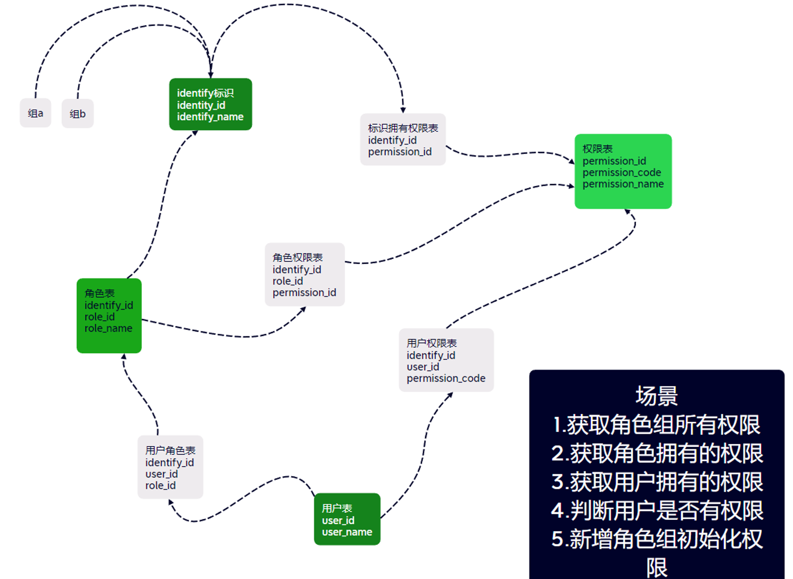

# zkgj_video_surveillance

### 开发工具

1.安装air： go install github.com/cosmtrek/air@latest

2.安装stringer： go install golang.org/x/tools/cmd/stringer

### 开发命令

1. 根目录下执行 go generate, 更新errcode错误信息

### 权限设计
